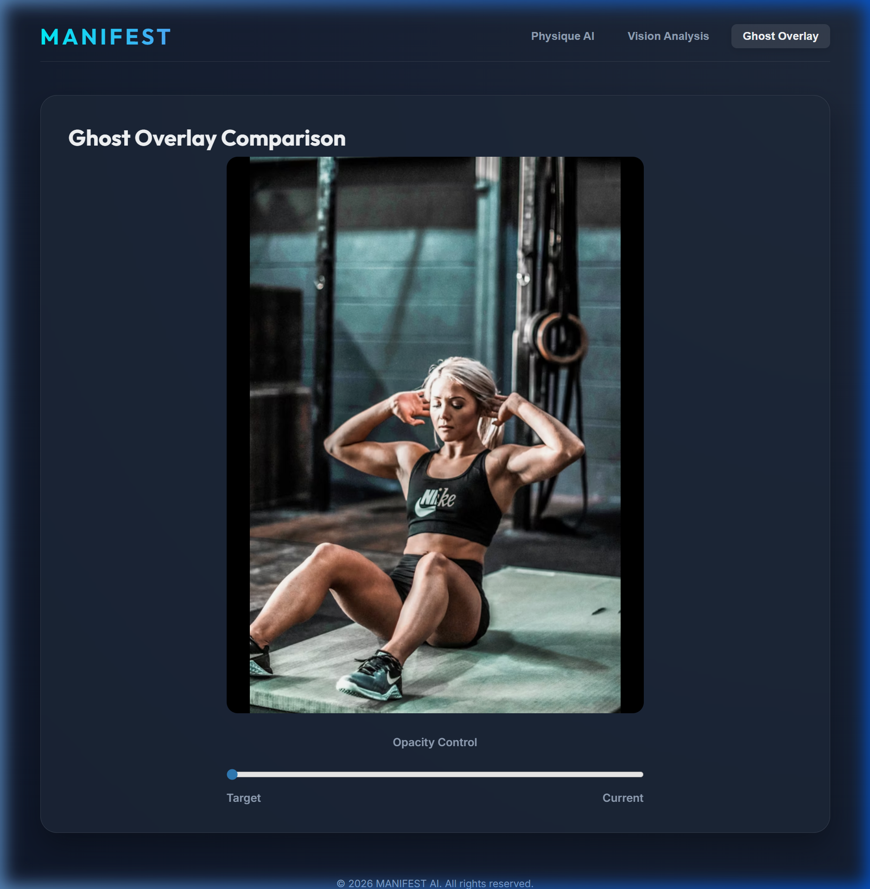

# Manifest (매니페스트): 이끌림의 법칙 다이어트

> **"당신이 원하던 그 몸매, 이미 당신 안에 있습니다. Ghost Overlay로 오늘의 나와 미래의 나를 연결하세요."**



## 🚀 프로젝트 개요 (Context)

**Manifest**는 시각적 보상과 데이터 기반의 성취감을 중시하는 다이어터를 위한 앱입니다. 사용자가 되고 싶은 '미래의 몸매'를 AI로 생성하고, 현재 신체 데이터와의 일치율($\%$)을 실시간으로 추적함으로써 다이어트 여정을 더욱 흥미롭고 강력하게 만듭니다.

## ✨ 핵심 기능 (Features)

1.  **AI Physique Generator**: 사용자의 얼굴과 목표 체형 프롬프트를 결합하여 Vertex AI(Imagen/Gemini) 기반의 고품질 이미지 생성.
2.  **Body Vision Analyzer**: MediaPipe Pose를 활용하여 사진 속 신체 주요 지점(Keypoints)을 추출하고 정량적 분석 수행.
3.  **Progress Algorithm**: 유클리드 거리를 기반으로 목표와 현재 사이의 진척도($\%$) 산출.
    $$Progress (\%) = \left( 1 - \frac{\sum |Target_{coord} - Current_{coord}|}{Total_{points}} \right) \times 100$$
4.  **Ghost Overlay UI**: 두 이미지를 투명하게 겹쳐 보여주는 비교 뷰를 통해 시각화된 변화 확인.

## 🛠 기술 스택 (Tech Stack)

*   **Frontend**: HTML5, Vanilla CSS (Glassmorphism), JavaScript
*   **AI/ML**: Google Vertex AI, MediaPipe (Pose Detection)
*   **Language**: Python (Analyzer Core), JavaScript (Web UI)
*   **Database**: Firebase Firestore

## 📂 시작하기

### 웹 상에서 즉시 확인
현재 `web/index.html` 파일을 브라우저로 열면 UI 및 인터랙션 시뮬레이션을 즉시 확인하실 수 있습니다.

### Python 분석기 실행
신체 키포인트 추출 코드가 포함된 `core/vision_analyzer.py`를 실행하기 위해 아래 과정을 거치세요:

```bash
# 1. 가상환경 생성 및 활성화
python -m venv venv
.\venv\Scripts\activate

# 2. 필수 라이브러리 설치
pip install -r requirements.txt

# 3. 분석기 실행
python core/vision_analyzer.py
```

---
© 2026 Manifest AI Team.